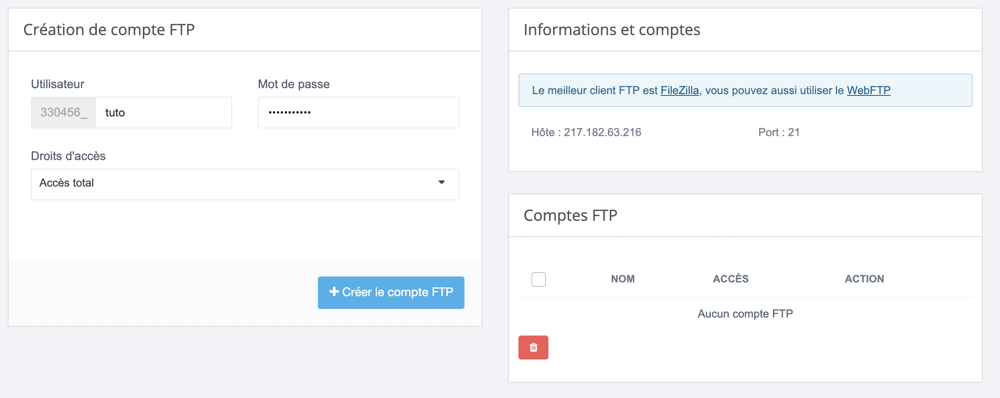
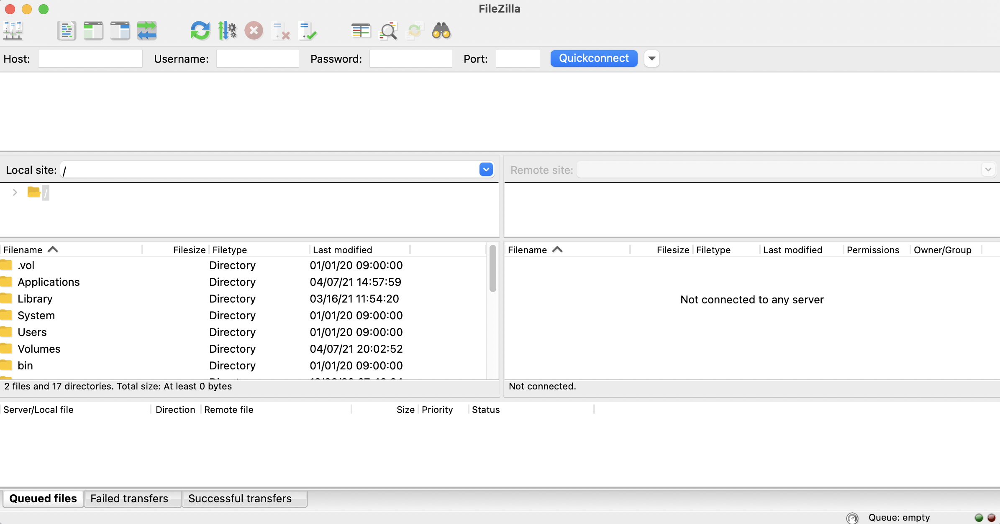
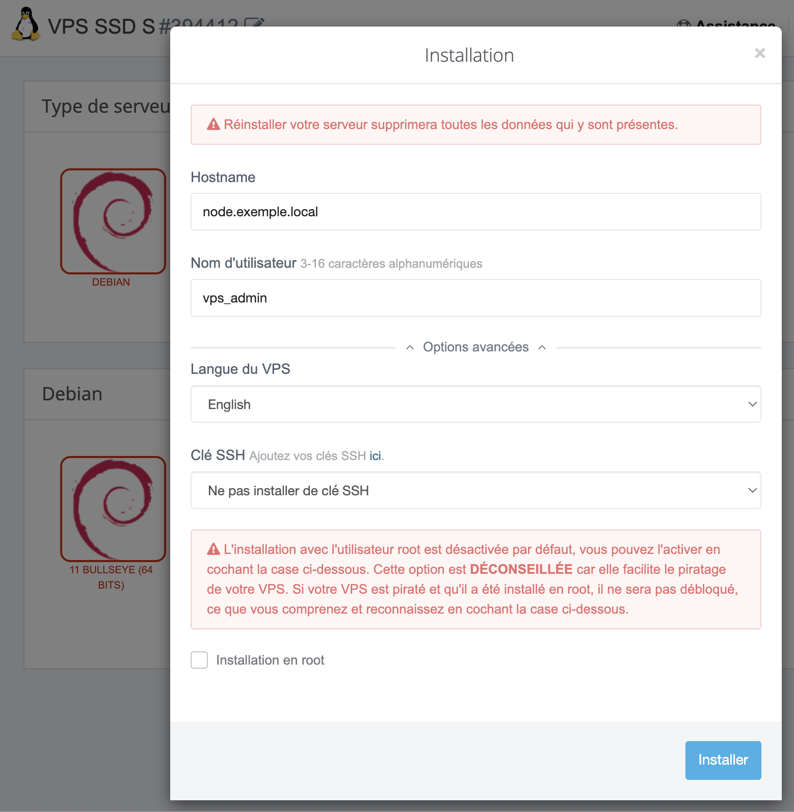

# Accéder au FTP

## Introduction - Pré-requis

Le protocole FTP vous permet de gérer facilement les fichiers de votre serveur avec un client sur votre ordinateur. Plusieurs client existent, ici nous allons utiliser **FileZilla** qui est très répandu.

Téléchargez FileZilla sur le site officiel sur ce lien : [https://filezilla-project.org/download.php?show\_all=1](https://filezilla-project.org/download.php?show_all=1)

Créez vos accès FTP depuis le panel OMGSERV, pour cela aller sur votre serveur sur le panel OMGSERV puis dans l'onglet "**Accès FTP**" sur le menu à gauche. 

Vous allez voir trois blocs, celui qui nous intéresse est le premier "Création de compte FTP", ici vous allez saisir un **nom d'utilisateur** par exemple ici on prendra "tuto", puis un **mot de passe sécurisé** que vous allez retenir ou que vous noterez quelque part. N'oubliez pas cliquer sur "Créer le compte FTP" pour créer le compte 😄

##  Utilisation de FileZilla

Maintenant nos accès créés nous pouvons utiliser FileZilla ! Pour cela ouvrez le, vous allez tomber sur une page de ce style.

N'ayez pas peur ! Ce n'est pas très compliqué. Côté gauche vous avez les fichiers de votre ordinateur. Côté droit vous avez les fichiers de votre serveur, par défaut vous n'êtes connecté à aucun serveur donc vous n'avez rien \(mais ça arrive 😎\).

En haut vous avez une barre avec quatre champs qu'il va falloir compléter avec les informations présent sur le panel OMGSERV. Pour cela retourner dans l'onglet "Accès FTP", et regardez le second et le troisième bloc.

Vous devez voir un champ "**Hôte**", un champ "**Port**" ainsi qu'un champ "**Nom**" et qu'avons-nous dans FileZilla dans la barre en haut ? **Les même champs !** Il suffit juste de copier coller les informations. Dans notre cas nous aurons.

Dans le champ "Mot de passe" \(ici "password"\) mettez votre mot de passe sécurisé que vous avez renseigné au début du tutoriel 🕵🏻‍♂️

Ensuite cliquez sur "Connexion" \(ici "quickconnect"\), si vous avez un message d'alerte de sécurité cliquez sur "Ok" et c'est bon ! Vous y êtes ! Vous avez désormais accès à vos fichiers de votre serveur 🥳

