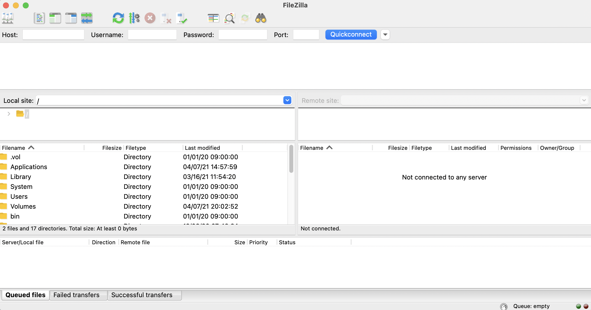

# Connect to FTP

## Introduction - Prerequisite

The FTP protocol allows you to easily manage the files on your server with a client on your computer. Several clients exist, here we will use **FileZilla** which is very widespread.

Download FileZilla from the official website at this link: [https://filezilla-project.org/download.php?type=client](https://filezilla-project.org/download.php?type=client)

Create your FTP accesses from the OMGSERV panel, to do this go to your server on the OMGSERV panel then to the "FTP" tab on the left menu.

You will see three blocks, the one we are interested in is the first one "FTP account creation", here you will enter a **username** for example here we will take "tuto", then a **secure password** that you will remember or write down somewhere. Don't forget to click on "Create the FTP account" to create the account 😄

## How to use FileZilla

Now our accesses created we can use FileZilla ! To do this, open it and you will see a page like this.

Don't be afraid! It is not very complicated. On the left side you have the files of your computer. Right side you have the files of your server, by default you are not connected to any server so you have nothing \(but it happens 😎\).

At the top you have a bar with four fields that you will have to complete with the information present on the OMGSERV panel. To do this go back to the "FTP" tab, and look at the second and third blocks.

You should see a "**Host**" field, a "**Port**" field and a "**Username**" field and what do we have in FileZilla in the top bar? **The same fields**! You just have to copy and paste the information. In our case we will have.

In the "Password" field put your secure password that you filled in at the beginning of the tutorial 🕵🏻

Then click on "Quickconnect", if you have a security alert message click on "Ok" and you're done! You are there! You now have access to your files on your server 🥳

