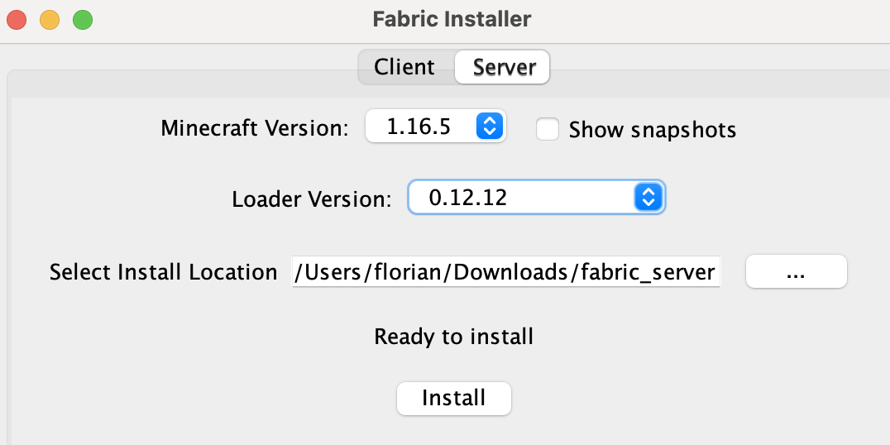

# Install Fabric via Openmod


**Do a server save before reading this tutorial** if you'd like to keep files from your actual server we made a tutorial [here](sauvegarde-et-restauration.md#make-a-backup).


**Installation**

* Download the [universal fabric installer](https://fabricmc.net/use/installer/).
* On your computer, open the downloaded `.jar` with Java and install fabric in server mode. Don't forget to select an empty installation folder (see screenshot below).

<figure><figcaption>
Fabric installer in server mode
</figcaption></figure>

* On the OMGSERV panel select the reinstallation tab, then select Openmod
* Drag the `fabric-server-launch.jar` then proceed
* Select the previous JAR file as the "starting jar" and proceed
* Connect on your FTP server (either via the WebFTP on your panel or via a [client](connect-to-ftp.md))
* Upload the `libraries` folder and the `server.jar`
* On the OMGSERV panel under the "properties" tab, change the version of Java used:
  * For versions under 1.16 select **Java 8**
  * For version 1.16 select **Java 11**
  * For version 1.17 select **Java 16**
  * For versions 1.18 and more select **Java 17**
* You can now start your server under Fabric

If your server successfully started, you can now close it and upload your mods JAR files in the mods folder in the server ftp


Some mods requires l`ibraries` folder to work, if a `libraries` folder is included with your mod, you will need to upload it's content in the `libraries` folder of your server.

