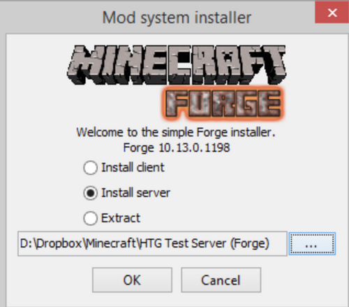

# Install Forge via Openmod

## Installation

* Download on [Forge's website](http://files.minecraftforge.net) the desired version of Forge \(example: 1.12.2-14.23.5.2838\).
* Install Forge in server version, take care to enter an empty installation folder \(see the capture below\).
* Perform a server reinstallation in the "Reinstall" tab and select Openmod.
* Drag **both `.jar` \(server and client\), the `libraries` folder and the `.json` file** that will have been extracted previously.
* Set the **.jar client** as **.jar startup** \(OMGSERV requires it\).

## Configuration

* Start the server. If it does not start, make sure that Java 8 is enabled in the panel **properties**.
* Wait for the server to turn on completely \(see the console if necessary\) then turn off the server.
* Connect in FTP on the server with an FTP client like [FileZilla](https://filezilla-project.org/download.php?type=client) \([tutorial](https://www.omgserv.com/en/faq-minecraft/how_to_create_and_use_ftp_acces-86/)\) \(or with WebFTP from the OMGSERV panel but this is not recommended because many bugs\). 
* Drag the mods into the `mods` folder, as well as the configuration if there is one.
* Delete the `world` folder to reset the map \(⚠️ this will delete everything on the map, more information with [this tutorial](https://docs.idelya-network.fr/minecraft/dois-je-supprimer-mon-monde)\).
* Finally, you can start your server and if everything has been well done \(mods compatible with each other, all files present and good version of Forge\) normally you should have your Minecraft server with your mods.

